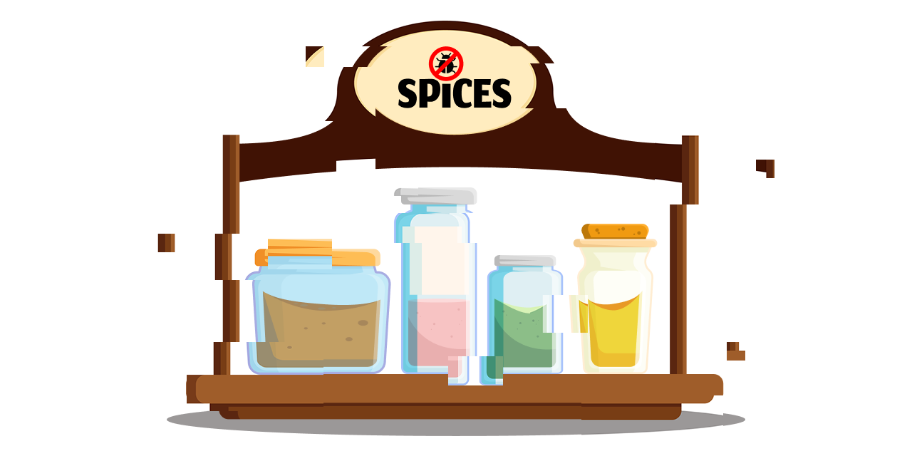

# 🫙🌶 Spices

<div align="center">
<h4>Spices makes it straightforward to create in-app debug menus by generating native UI from Swift.</h4>



[](https://github.com/shapehq/shpspices/actions/workflows/build.yml)
[](https://github.com/shapehq/shpspices/actions/workflows/build_example_project.yml)
[](https://github.com/shapehq/shpspices/actions/workflows/swiftlint.yml)
[](https://github.com/shapehq/spices/actions/workflows/build_documentation.yml)
[](https://github.com/shapehq/spices/actions/workflows/test.yml)
</div>

- [👋 Introduction](#-introduction)
- [🚀 Getting Started](#-getting-started)
    - [Step 1: Add the Spices Swift Package](#step-1-add-the-spices-swift-package)
    - [Step 2: Create an In-App Debug Menu](#step-2-create-an-in-app-debug-menu)
    - [Step 3: Present the In-App Debug Menu](#step-3-present-the-in-app-debug-menu)
    - [Step 4: Observing Values](#step-4-observing-values)
- [🧪 Example Projects](#-example-projects)
- [📖 Reference](#-reference)
  - [Toggles](#toggles)
  - [Pickers](#pickers)
  - [Buttons](#buttons)
  - [Hierarchical Navigation](#hierarchical-navigation)
  - [Require Restart](#require-restart)
  - [Display Custom Name](#display-custom-name)
  - [Specify Editor Title](#specify-editor-title)
  - [Store Values in Custom UserDefaults](#store-values-in-custom-userdefaults)
  - [Store Values Under Custom Key](#store-values-under-custom-key)
  - [Using with @AppStorage](#using-with-appstorage)

## 👋 Introduction

Spices generates native in-app debug menus from Swift code using the `@Spice` property wrapper and `SpiceStore` protocol and stores settings in [UserDefaults](https://developer.apple.com/documentation/foundation/userdefaults).

We built Spices at [Shape](https://shape.dk) (becoming [Framna](https://framna.com)) to provide a frictionless API for quickly creating these menus. Common use cases include environment switching, resetting state, and enabling features during development.


## 🚀 Getting Started

This section details the steps needed to add an in-app debug menu using Spices.

### Step 1: Add the Spices Swift Package

Add Spices to your Xcode project or Swift package.

```swift
let package = Package(
    dependencies: [
        .package(url: "git@github.com:shapehq/spices.git", from: "4.0.0")
    ]
)
```

### Step 2: Create an In-App Debug Menu

Spices uses [reflection](https://en.wikipedia.org/wiki/Reflective_programming) to generate UI from the properties of a type conforming to the `SpiceStore` protocol

> [!IMPORTANT]
> Reflection is a technique that should be used with care. We use it in Spices, a tool meant purely for debugging, in order to make it frictionless to add a debug menu.

The following shows an example conformance to the SpiceDispenser protocol. You may copy this into your project to get started.

```swift
enum ServiceEnvironment: String, CaseIterable {
    case production
    case staging
}

class AppSpiceStore: SpiceStore {
    @Spice(requiresRestart: true) var environment: ServiceEnvironment = .production
    @Spice var enableLogging = false
    @Spice var clearCache = {
        try await Task.sleep(for: .seconds(1))
        URLCache.shared.removeAllCachedResponses()
    }
    @Spice var featureFlags = FeatureFlagsSpiceStore()
}

class FeatureFlagsSpiceStore: SpiceStore {
    @Spice var notifications = false
    @Spice var fastRefreshWidgets = false
}
```

Based on the above code, Spices will generate an in-app debug menu like the one shown below.


### Step 3: Present the In-App Debug Menu

The app must be configured to display the spice editor. The approach depends on whether your app is using a SwiftUI or UIKit lifecycle.

> [!WARNING]
> The in-app debug menu may contain sensitive information.  Ensure it's only accessible in debug and beta builds by excluding the menu's presentation code from release builds using conditional compilation (e.g., `#if DEBUG`).  The examples in this section demonstrate this technique.

#### SwiftUI Lifecycle

Use the `presentSpiceEditorOnShake(_:)` view modifier to show the editor when the device is shaken.

```swift
struct ContentView: View {
    @StateObject var spiceStore = AppSpiceStore()

    var body: some View {
        VStack {
            Image(systemName: "globe")
                .imageScale(.large)
                .foregroundStyle(.tint)
            Text("Hello, world!")
        }
        .padding()
        #if DEBUG
        .presentSpiceEditorOnShake(editing: spiceStore)
        #endif
    }
}
```

Alternatively, manually initialize and display an instance of `SpiceEditor`.

```swift
struct ContentView: View {
    @StateObject var spiceStore = AppSpiceStore()
    @State var isSpiceEditorPresented = false

    var body: some View {
        Button {
            isSpiceEditorPresented = true
        } label: {
            Text("Present Spice Editor")
        }
        .sheet(isPresented: $isSpiceEditorPresented) {
            SpiceEditor(editing: spiceStore)
        }
    }
}
```

#### UIKit Lifecycle

Use the an instance of `SpiceEditorWindow` to show the editor when the device is shaken.

```swift
class SceneDelegate: UIResponder, UIWindowSceneDelegate {
    var window: UIWindow?

    func scene(
        _ scene: UIScene,
        willConnectTo session: UISceneSession,
        options connectionOptions: UIScene.ConnectionOptions
    ) {
        let windowScene = scene as! UIWindowScene
        #if DEBUG
        window = SpiceEditorWindow(windowScene: windowScene, editing: AppSpiceStore.shared)
        #else
        window = UIWindow(windowScene: windowScene)
        #endif
        window?.rootViewController = ViewController()
        window?.makeKeyAndVisible()
    }
}
```

Alternatively, initialize an instance of `SpiceEditorViewController` and present it.

```swift
let viewController = SpiceEditorViewController(editing: AppSpiceStore.shared)
present(spicesViewController, animated: true)
```

### Step 4: Observing Values

The currently selected value can be referenced through a spice store:

```swift
AppSpiceStore.environment
```

#### SwiftUI Lifecycle

Spice stores conforming to the `SpiceStore` protocol also conform to [ObservableObject](https://developer.apple.com/documentation/combine/observableobject), and as such, can be observed from SwiftUI using [StateObject](https://developer.apple.com/documentation/swiftui/stateobject), [ObservedObject](https://developer.apple.com/documentation/swiftui/observedobject), or [EnvironmentObject](https://developer.apple.com/documentation/swiftui/environmentobject).

```swift
class AppSpiceStore: SpiceStore {
    @Spice var enableLogging = false
}

struct ContentView: View {
    @StateObject var spiceStore = AppSpiceStore()
    
    var body: some View {
        Text("Is logging enabled: " + (spiceStore.enableLogging ? "👍" : "👎"))
    }
}
```

#### UIKit Lifecycle

Properties using the `@Spice` property wrapper exposes a publisher that can be used to observe changes to the value using [Combine](https://developer.apple.com/documentation/combine).

```swift
class ContentViewController: UIViewController {
    private let spiceStore = AppSpiceStore.shared
    private var cancellables: Set<AnyCancellable> = []
    
    override func viewDidLoad() {
        super.viewDidLoad()
        spiceStore.$enableLogging
            .sink { isEnabled in
                print("Is logging enabled: " + (isEnabled ? "👍" : "👎"))
            }
            .store(in: &cancellables)
    }
}
```

## 🧪 Example Projects

The example projects in the [Examples](/Examples) folder shows how Spices can be used to add an in-app debug menu to iOS apps with SwiftUI and UIKit lifecycles.

## 📖 Reference

The following documents the specifics of the framework.

### Toggles

Toggles are created for boolean variables in a spice store.

```swift
@Spice var enableLogging = false
```

### Pickers

Pickers are created for types conforming to both [RawRepresentable](https://developer.apple.com/documentation/swift/rawrepresentable) and [CaseIterable](https://developer.apple.com/documentation/swift/caseiterable). This is typically enums.

```swift
enum ServiceEnvironment: String, CaseIterable {
    case production
    case staging
}

class AppSpiceStore: SpiceStore {
    @Spice var environment: ServiceEnvironment = .production
}
```

Conforming the type to `SpicesTitleProvider` lets you override the displayed name for each case.

```swift
enum ServiceEnvironment: String, CaseIterable, SpicesTitleProvider {
    case production
    case staging

    var spicesTitle: String {
        switch self {
        case .production:
            "🚀 Production"
        case .staging:
            "🧪 Staging"
        }
    }
}
```

### Buttons

Closures with no arguments are treated as buttons.

```swift
@Spice var clearCache = {
    URLCache.shared.removeAllCachedResponses()
}
```

Providing an asynchronous closure causes a loading indicator to be displayed for the duration of the operation.

```swift
@Spice var clearCache = {
    try await Task.sleep(for: .seconds(1))
    URLCache.shared.removeAllCachedResponses()
}
```

An error message is automatically shown if the closure throws an error.

### Hierarchical Navigation

Spice stores can be nested to create a hierarchical user interface.

```swift
class AppSpiceStore: SpiceStore {
    @Spice var featureFlags = FeatureFlagsSpiceStore()
}

class FeatureFlagsSpiceStore: SpiceStore {
    @Spice var notifications = false
    @Spice var fastRefreshWidgets = false
}
```

### Require Restart

Setting `requiresRestart` to true will cause the app to be shut down after changing the value. Use this only when necessary, as users do not expect a restart.

```swift
@Spice(requiresRestart: true) var environment: ServiceEnvironment = .production
```

### Display Custom Name

By default, the editor displays a formatted version of the property name. You can override this by manually specifying a custom name.

```swift
@Spice(name: "Debug Logging") var enableLogging = false
```

### Specify Editor Title

By default the editor will be displayed with the title "Debug Menu". This can be customized as follows.

**SwiftUI Lifecycle**

The `presentSpiceEditorOnShake(editing:title:)` view modifier takes a title as follows.

```swift
.presentSpiceEditorOnShake(editing: spiceStore, title: "Config")
```

The title can also be specified when manually creating and presenting an instance of `SpiceEditor`.

```swift
SpiceEditor(editing: spiceStore, title: "Config")
```

**UIKit Lifecycle**

The ``SpiceEditorWindow`` can be initialized with a title as follows.

```swift
SpiceEditorWindow(windowScene: windowScene, editing: AppSpiceStore.shared, title: "Config")
```

The title can also be specified when manually creating and presenting an instance of `SpiceEditorViewController`.

```swift
let viewController = SpiceEditorViewController(editing: AppSpiceStore.shared, title: "Config")
```

### Store Values in Custom UserDefaults

By default, values are stored in [UserDefaults.standard](https://developer.apple.com/documentation/foundation/userdefaults/1416603-standard). To use a different [UserDefaults](https://developer.apple.com/documentation/foundation/userdefaults) instance, such as for sharing data with an app group, implement the `userDefaults` property of `SpiceStore`.

```swift
class AppSpiceStore: SpiceStore {
    let userDefaults = UserDefaults(suiteName: "group.dk.shape.example")
}
```

### Store Values Under Custom Key

Values are stored in [UserDefaults](https://developer.apple.com/documentation/foundation/userdefaults) using a key derived from the property name, optionally prefixed with the names of nested spice stores. You can override this by specifying a custom key.

```swift
@Spice(key: "env") var environment: ServiceEnvironment = .production
```

### Using with @AppStorage

Values are stored in [UserDefaults](https://developer.apple.com/documentation/foundation/userdefaults) and can be used with [@AppStorage](https://developer.apple.com/documentation/swiftui/appstorage) for seamless integration in SwiftUI.

```swift
struct ExampleView: View {
    @AppStorage("enableLogging") var enableLogging = false

    var body: some View {
        Toggle(isOn: $enableLogging) {
            Text("Enable Logging")
        }
    }
}
```
